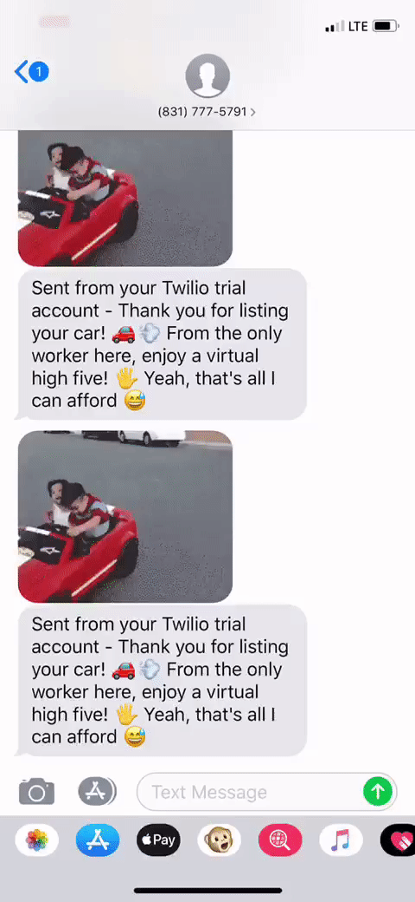

# Production Readme

[FLEXO Live](https://flex-o.herokuapp.com/#/)

[Design docs](https://github.com/le-s/FLEXO/wiki)

FLEXO is a full-stack, one page application that utilizes Ruby on Rails for the backend, PostgreSQL for the database, and React/Redux for the frontend. This website features extraordinary cars available to rent to experience the road from a different window. Find the car that will fit the experience for you by viewing the different details each car has.

## Technologies used
- Javascript
- Ruby on Rails
- React/Redux
- PostgreSQL
- HTML/CSS

## APIs used
- Twilio SMS API
- SendGrid Email API
- Google Maps API
- Google Places API
- Google Geocoding API

## Features

- Frontend to backend user authentication
- Users can view different cars in an organized manner
- Each car displays a detailed specs and information about the car
- Users are able to create their own cars for rent
- Users receive a text message/email upon signing up for an account or listing their cars
- Users can search for a car in any location with the Google Maps API

## Highlights

### Twilio SMS API
A text message is sent to the user whenever they list one of their cars. (SMS will only be sent to my personal phone due to Twilio trial account)

<a href="https://github.com/le-s/FLEXO/blob/master/app/assets/images/sms.gif"></a>

```rb
# ./app/controllers/api/cars_controller.rb
def create
  @car = Car.new(car_params)

  if @car.save
    render 'api/cars/show'
    send_message(
      car_params[:phone_number], 
      "Thank you for listing your car! 🚗💨 From the only worker here, enjoy a virtual high five! 🖐 Yeah, that's all I can afford 😅"
    )
  else
    render json: @car.errors.full_messages, status: 422
  end
end
  
def send_message(phone_number, alert_message)
  @twilio_number = ENV['twilio_number']
  @client = Twilio::REST::Client.new(ENV['twilio_sid'], ENV['twilio_api_key'])

  message = @client.api.account.messages.create(
    :from => @twilio_number,
    :to => phone_number,
    :body => alert_message,
    :media_url => "https://media2.giphy.com/media/QchsHzrPovJ3G/source.gif" 
  )
  puts message.to
end
```

### SendGrid Email API
An email is sent to the user when they create an account.

<a href="https://imgur.com/a/iRXdQ7r"></a>

```rb
# ./app/controllers/api/users_controller.rb
def create
  @user = User.new(user_params)
  
  if @user.save
    login(@user)
    render 'api/users/show'
    UserNotifierMailer.send_signup_email(@user).deliver
  else
    render json: @user.errors.messages, status: 422
  end
end
  
# ./app/mailer/user_notifier_mailer.rb
def send_signup_email(user)
  @user = user
  
  mail( 
    :from => ENV['FROM_EMAIL'],
    :to => @user.email, 
    :subject => "Welcome to Flexo!",
  )
end

# ./config/environment.rb
ActionMailer::Base.smtp_settings = {
  :user_name => 'apikey',
  :password => ENV['SENDGRID_API_KEY'],
  :domain => 'Flexo.com',
  :address => 'smtp.sendgrid.net',
  :port => 587,
  :authentication => :plain,
  :enable_starttls_auto => true
}
```
### Search Feature
With Google Places API, as users search for a location the Places API autopopulates suggested locations. The location is then passed to the Google Geocoding API which will return a longitude and latitude. The Northeast and Southwest coordinates were used to filter out any cars outside of the bounds.

<a href="https://github.com/le-s/FLEXO/blob/master/app/assets/images/search.gif"></a>

```js
componentDidMount() {
  let input = document.getElementById('search-bar')
  let autocomplete = new google.maps.places.Autocomplete(input);
  let address;
  google.maps.event.addDomListener(window, 'load', autocomplete);
  autocomplete.addListener('place_changed',() => {
    if (!autocomplete.getPlace().formatted_address) {
      // use input if cannot convert to formatted address
      address = autocomplete.getPlace().name;
      this.setState({ address: address })
    } else {
      // use formatted address if available
      address = autocomplete.getPlace().formatted_address;
      this.setState({ address: address })
    }
  })
}

handleSubmit() {
  let lat;
  let lng;
  let coordinates = new google.maps.Geocoder()
  coordinates.geocode({ 'address': this.state.address }, (results, status) => {
    if (status === 'OK') {
      lat = results[0].geometry.location.lat();
      lng = results[0].geometry.location.lng();
      this.props.history.push(`/cars?lat=${lat}&lng=${lng}`)
    } else {
      lat = 37.773972;
      lng = -122.431297;
      this.props.history.push(`/cars?lat=${lat}&lng=${lng}`)
    }
  })
}
```

## Future features
- Rentals
- Reviews
